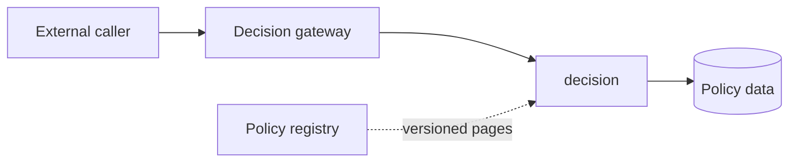

# Architecture

The repository contains a serving path and a versioned policy distribution path.

## Current serving path

1. The gateway forwards a decision request without decoding its JSON body.
2. The decision service evaluates the request using its policy data.
3. The evaluator applies ordered rules.
4. The response includes the revision that produced the decision.
5. The gateway preserves the status, end-to-end headers, and response bytes.

The decision service starts with bundled revision 1. The registry is deployed separately through
the optional `refresh` Compose profile.

## Components

| Component | Language | Responsibility |
| --- | --- | --- |
| `decision-gateway` | Go | Caller-facing HTTP forwarding |
| `decision-service` | Go | Policy evaluation |
| `policy-registry` | Python | Published bundle fixtures |
